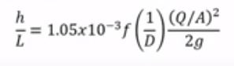
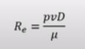
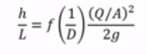
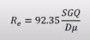

### File 1: Hall and Yarborough Correlation

My first code in Python is solving the Z factor , which is used in petroleum design. 
There is a very complicated method through the graphs. But using this correlation, it becomes quite simple. 
Also the difference between both the values of Z-factor is quite negligible. 
This graph is used to calculate the Z factor manually.

### File 2: Frictional Pressure Loss in Pipelines 

My second code in python is calculating the frictional pressure loss in pipelines. Fluid Programming is a great deal in Oil and Gas Engineering. 
I have done a step by step calculation to calculate the frictional pressure loss in pipeline for single phase flow. 
I used the Swamee - Jain Equation (1976) to calculate the friction factor based on the reynolds number. 
Basic Equation to calculate the Friction Pressure loss are : 

  

Specifically for Oil and gas these equations are modified as: 

  

### File 3: Casing Seat Selection

My third code in python is solving the casing seat selection in drilling engineering domain with the help of python language. I have used numpy.interp in the eaton's curve to calculate the depth at which casing needs to be placed. 
