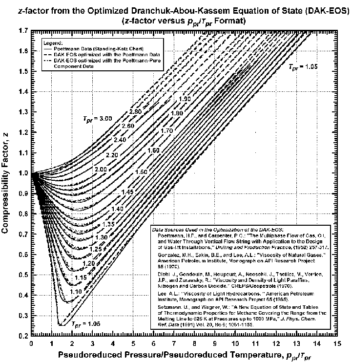

# Hall and Yarborough Correlation

My first code in Python is solving the Z factor , which is used in petroleum design. 
There is a very complicated method through the graphs. But using this correlation, it becomes quite simple. 
Also the difference between both the values of Z-factor is quite negligible. 

This graph is used to calculate the Z factor manually. 

